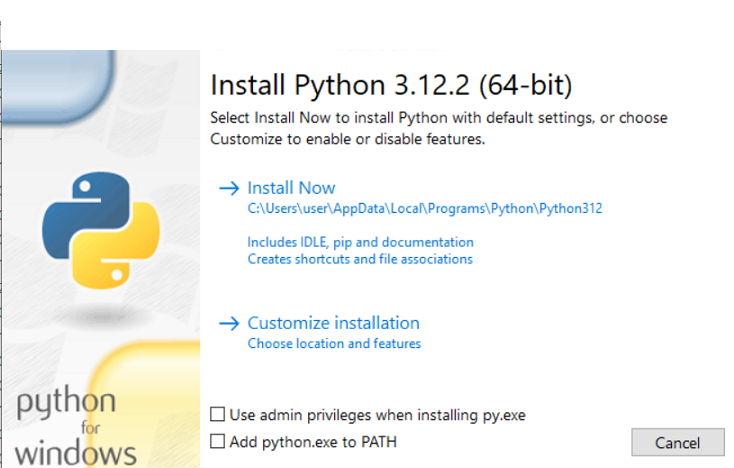
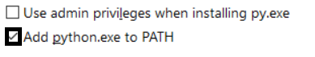
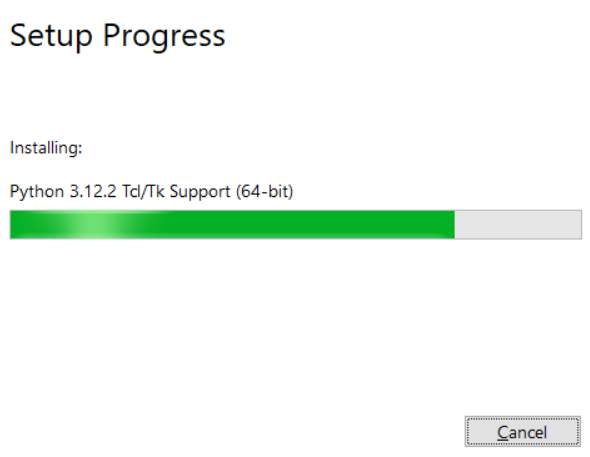
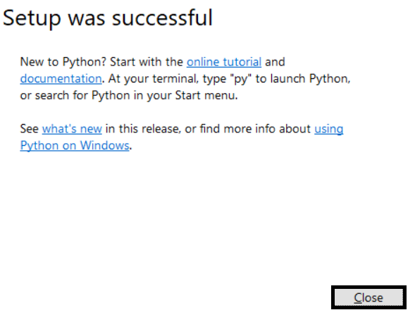

# Getting started

---

## What is Python?
Well, Python is a programming language.<br>
IF you want to skip this then go to next page

> <p style="color:orange">⚠ WARNING:</p> You should note that even if you know what is programming language and python installed your python version should be 3.x or latest is better.

---

# How to install it?

The installation is easy but don't always click next next and install there is need some little things!

## So first up we are going to download PYTH0N

the latest version for windows 10/11 is 3.12.2 as of development of this C0URSE

> Downloading on windows 10 or later is easy as of auto detecting from your browser
> Same applies to MacOS but no need to look at your MacOS versions to pick

### For windows users
1. For windows 8/8.1/10/11 users: [Python Downloads](https://www.python.org/downloads)<br>
2. For windows XP/Vista/7 users: I reccommend upgrading to atleast Windows 10 because it might be hard, [Python 3.9.13 Downloads](https://www.python.org/downloads/release/python-3913/)
### For Linux Users
Linux is really easy there is guide by what distro you have<br>
1. Arch Linux based: ```sudo pacman -S python3```<br>
2. Debian based (Ubuntu applies too): ```sudo apt install python3```<br>
3. RHEL based: ```sudo yum install python3``` or ```sudo dnf install python3```<br>
4. Fedora based: ```sudo dnf install python3```<br>
5. Gentoo based: ```sudo emerge dev-lang/python```<br>
and done you already have pyth0n
### For MacOS users
Basically i don't know you just download it from [Python Downloads](https://www.python.org/downloads)<br>
I think installation is easy **i guess**.<br>
So it's Do It Yourself

## Next step: Installing!
#### For Linux users can skip
#### For MacOS: You just press 'Continune' and Agree the license (read if you want)
#### For Windows: Be prepared it's maybe a long one (I'm not responsible for Windows 7 users)
So the installer should look like this:<br>

> NOTE: That black painted ones are to select or click (y'know english but just for noobs or skim-readers)
Please tick/check this checkbox or else it will cause problems to get Pyth0n working


Then go to install now


The installation should look like this (don't care about text after installing)


If installation is done then click Close


# Now you finally installed PYTH0N!!
Now go to next page to setup an IDE
[Setting up IDE](Setting%20up%20IDE.md)